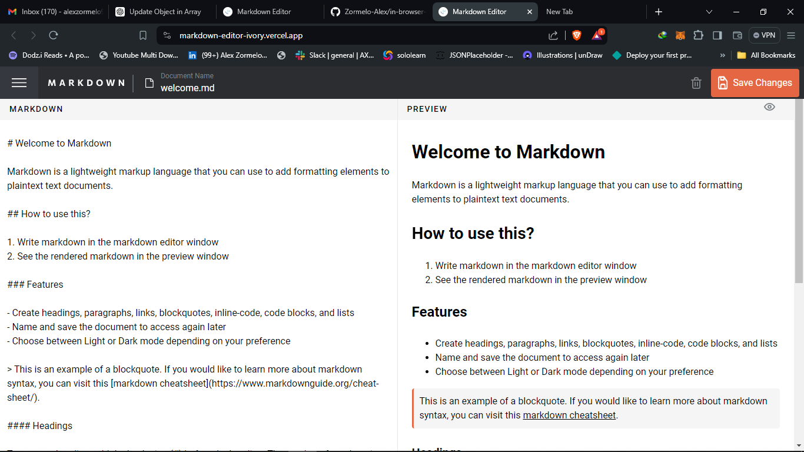

# Frontend Mentor - In-browser markdown editor solution

This is a solution to the [In-browser markdown editor challenge on Frontend Mentor](https://www.frontendmentor.io/challenges/inbrowser-markdown-editor-r16TrrQX9). Frontend Mentor challenges help you improve your coding skills by building realistic projects.

## Table of contents

  - [The challenge](#the-challenge)
  - [Screenshot](#screenshot)
  - [Links](#links)
- [My process](#my-process)
  - [Built with](#built-with)
  - [What I learned](#what-i-learned)
  - [Continued development](#continued-development)
  - [Useful resources](#useful-resources)
- [Author](#author)
- [Acknowledgments](#acknowledgments)


### The challenge

Users should be able to:

- Create, Read, Update, and Delete markdown documents
- Name and save documents to be accessed as needed
- Edit the markdown of a document and see the formatted preview of the content
- View a full-page preview of the formatted content
- View the optimal layout for the app depending on their device's screen size
- See hover states for all interactive elements on the page
- **Bonus**: If you're building a purely front-end project, use localStorage to save the current state in the browser that persists when the browser is refreshed
- **Bonus**: Build this project as a full-stack application

### Screenshot



### Links

- Solution URL: [Add solution URL here](https://github.com/Zormelo-Alex/in-browser-markdown-editor)
- Live Site URL: [Add live site URL here](https://markdown-editor-ivory.vercel.app/)

### Built with

- React (Vite)
- CSS custom properties
- Flexbox
- CSS Grid
- Mobile-first workflow
- [React](https://reactjs.org/) - JS library
- [Tailwind](https://https://tailwindcss.com/) - CSS framework

### What I learned

Use this section to recap over some of your major learnings while working through this project. Writing these out and providing code samples of areas you want to highlight is a great way to reinforce your own knowledge.

To see how you can add code snippets, see below:

```html
    <>
      <Markdown
        remarkPlugins={[remarkGfm]}
        rehypePlugins={[rehypeHighlight, rehypeRaw]}
        className={"markdown"}
      >
        {isEmpty ? emptyMarkdown : content}
      </Markdown>
    </>
```

```css
.markdown > * {
  all: revert;
}
```

```js
useEffect(() => {
    setSelected(documentData[selectedID]);
    if (!documentData.length) {
      setIsEmpty(true);
      setIsNavOpen(true);
    } else {
      setIsEmpty(false);
    }
    localStorage.setItem("markdown-data", JSON.stringify(documentData));
  }, [documentData]);
```


### Useful resources

- [Toastify](https://www.npmjs.com/package/react-toastify) - This helped me display usefull toast notifications to aid user interactivity. I really liked this pattern and will use it going forward.
- [React-Markdown](https://www.npmjs.com/package/react-markdown) - This is an amazing package which helped me finally display the markdown text in jsx. I'd recommend it to anyone still learning this concept.

## Author

- Website - [Zormelo Alex](https://dodz-i.vercel.app/)
- Linkedin - [@AlexZormelo](https://www.linkedin.com/in/alex-zormelo-ab5942213/)
- Twitter - [@DodziZormelo](https://x.com/DodziZormelo)

## Acknowledgments

I'd like to share that i used some online aids, i utilized openAi, stack overflow and youtube in my persuite to find a good markdown tool. I would recommend these aids in all regards.
